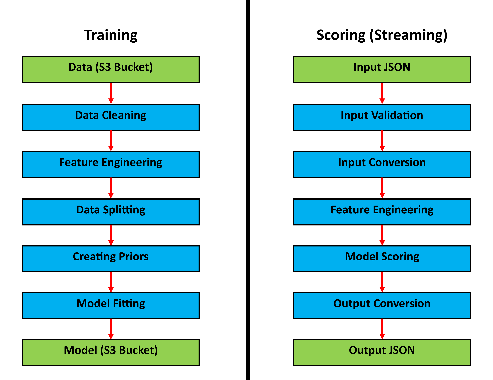
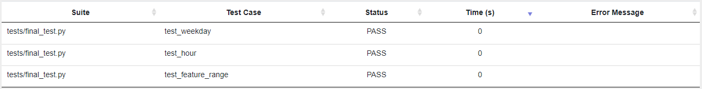

# Business Use Case: Ulabox

## Statement of Problem

Ulabox needs to find a strategy to increase the revenue generated from its existing customers.

## Client

Ulabox is an online grocery startup in Spain with €1 million in monthly revenue.

## Key Business Question

Is there a way to analyze customer buying patterns so that Ulabox can better target the product recommendations on their app and website?

## Data Sources

*The Ulabox Online Supermarket Dataset 2017, accessed from https://www.github.com/ulabox/datasets*

This dataset contains 30,000 orders from around 10,000 unique customers.

## Business Impact of Work

Ulabox currently has €1 million in monthly revenue from about 10,000 customers, which means that each customer spends on average €100 per month.

They assume that better targeted product recommendations will lead to customers spending more money resulting in higher revenue. For example, if each customer spends on average €20 more per month, monthly revenue will increase by €200,000.

## How will Ulabox use the model to make decisions

Ulabox currently has 8 categories of products. The model will try to predict the share of each category a customer will purchase when they start shopping.

Those predictions will be used the determine the share of product recommendations for each category. For example, if a customer is predicted to have 50% of their purchase in the Fresh category, 50% of their product recommendations will also be in the Fresh category.

## Metric to be monitored to see if the model is promising

The predicted share of product categories will be compared with the actual share of product categories to evaluate the effectiveness of this model.

## Methodology

In this project, the goal of the model is to predict the share of customer spending in each category for a new order. The dataset already contains the share per category of all existing orders, as well as some additional independent variables. 80% of the dataset is used for training the model and the remaining 20% is used for testing.

**Model Justification:**

The Naïve Bayes classifier was chosen as the model, which uses Bayesian inferencing to output probabilities of each class in the outcome variable. This is appropriate for the business question because the probabilities can represent the expected share per category. The ‘Naïve’ part assumes that all the variables are independent of each other, which makes the computation easier.

**Modeling Approach:**

The ‘naive_bayes’ package from ‘sklearn’ was used to build this model. Some basic feature engineering was done to prepare the data for modeling, which include converting response variables to probabilities, scaling continuous variables to be between 0 and 1, and one hot encoding categorical variables. When training the model, the multinomial distribution was used since most of the features were discrete. Two versions of the model were tested, one with prior probabilities updated based on the data, and another with fixed prior probabilities based the overall mean share per category. The loss function used to evaluate the model was the absolute mean error for each category.

## Results

**Key Findings:**

The second version of the model with fixed priors was slightly better because the predictions were more balanced across categories. However, both versions of the were not very accurate in their overall predictions. This is mainly due to limitations in the dataset, since the explanatory variables did not have any strong relationship with the response variables. 

The following is the mean absolute error of the percentage share by category resulting from the second model.

Category | Mean Absolute Error
--- | ---
Drinks | 17%
Food | 16%
Fresh | 20%
Home | 13%
Baby | 17%
Beauty | 8%
Health | 2%
Pets | 2%

**Recommendations:**

Although the second model lacked accuracy, it can be used as a starting point for answering the business question. Ulabox should implement this model on their app and website because that is better than not having any model for product recommendations. If a model is already developed, it will be easier to add new data in the future to improve it, rather than rebuilding another model.

**Result Implementation:**

When a customer starts shopping, an input JSON file will contain the total items on their cart, the percentage of discounts applied, the day of the week, and the hour of the day. This file will go through a streaming process that will be run by a Python script. This process will run the inputs through the model and output another JSON file that will contain the percentage share of spending per category. The output values for each category will determine to the share of product recommendations the customer receives while they are shopping (example: *Output JSON* in *Design* section).

## Design

**Input JSON:**

{
"total_items": 20, 
"discount%": 4.09, 
"weekday": "Thu", 
"hour": "13h"
}

**Input Types:**

- *total_items:* integer
- *discount%:* float between 0 and 100
- *weekday:* string in [*Mon*, *Tue*, *Wed*, *Thu*, *Fri*, *Sat*, *Sun*]
- *hour:* string from *00h* to *23h* with increment of *01h*

**Output JSON:** 

{
 "Baby%": 8,
 "Beauty%": 4,
 "Drinks%": 26,
 "Food%": 24,
 "Fresh%": 23,
 "Health%": 2,
 "Home%": 13,
 "Pets%": 1
}

**Architecture Diagram:**

## Testing

There are 2 unit tests done after running the *input_conversion* function, verifying if the input values were correctly converted to their readable names. This is important because readable names are required for them to work as categorical variables. There is also an integration test done after running both the *input_conversion* and *feature_engineering* functions, verifying if all the features have values ranging from 0 to 1. This is important because the multinomial Naïve Bayes classifier requires all features to be between 0 and 1.

**Unit Tests:**

1. *test_weekday:* Tests if the *weekday* value is in the correct format.
2. *test_hour:* Tests if the *hour* value is in the correct format.

**Integration Test:**

- *test_feature_range:* Tests if all the values range from 0 to 1.

**Test Results:**

**Test Coverage:**

## Code Execution

**Requirements:**

- *Operating System:* Windows 10
- *Platform:* Anaconda 4.9.2
- *Language:* Python 3.8.5

**Input:**

In the *input_spec.json* file, there are example input values by default. You can change those values to your desired inputs. Make sure to follow the format shown in the *Input Types* of the *Design* section.

**Instructions:**

1. Create and activate an Anaconda environment with Python.
2. Install the Python packages listed in the *requirements.txt* file.
3. Put the *final.py* and *input_spec.json* files in the same directory.
4. Run the *final.py* file in Python.
5. Open the *output_spec.json* file in the same directory to view the output values.

**Warning:**

If you encounter a *ValueError* while running the *final.py* file, it means that your *input_spec.json* file is in the incorrect format. Change your inputs based on the error message and re-run the Python file.
